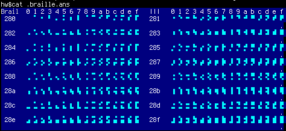
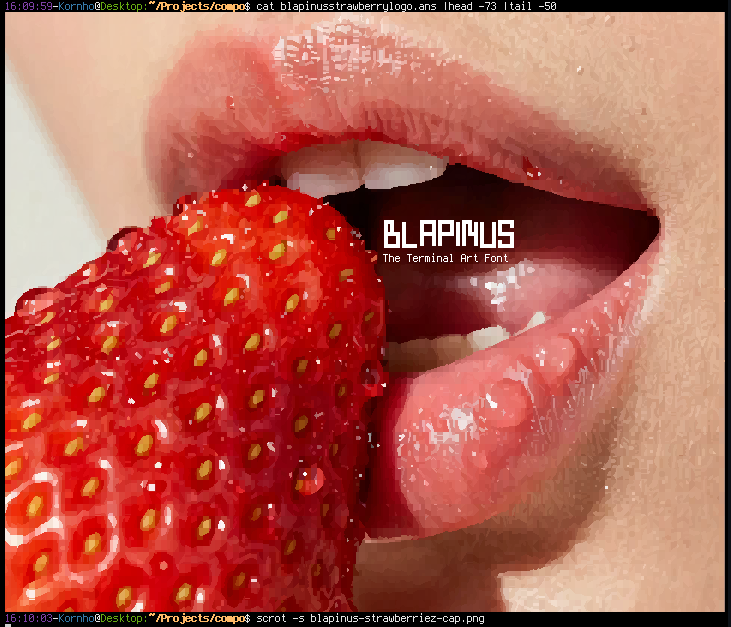
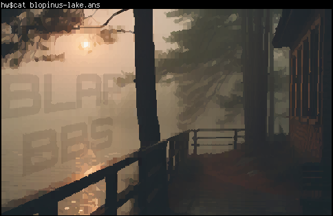
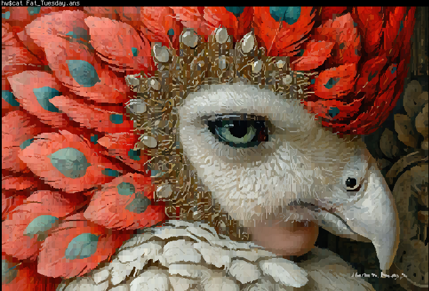
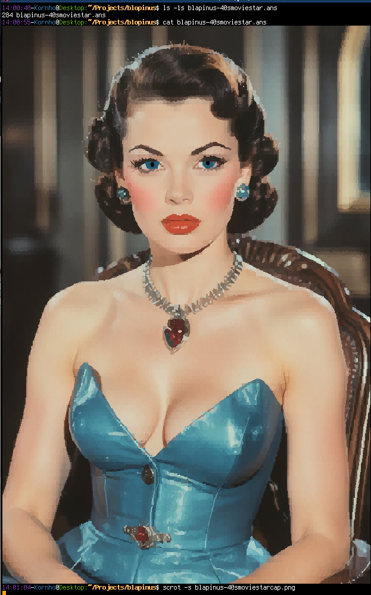

# blopinus-Terminal-Font
based on Termius 6x12. This font features extensive TUI drawing elements and standard glyphs optimized for TUI, including block-braille and full-width triangles a-la PETSCII

The most important feature, that all terminal fonts should adopt, is braille u2800-u28FF glyphs in block characters instead of dots.

I could go on. 

Pictures converted with hpjansson's "chafa" convertor.
